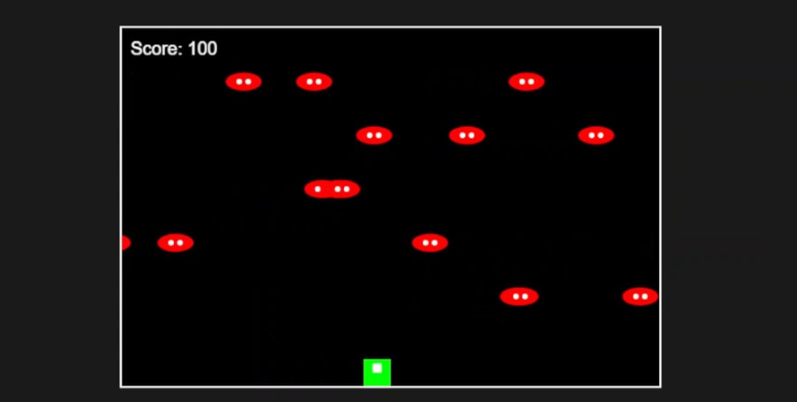
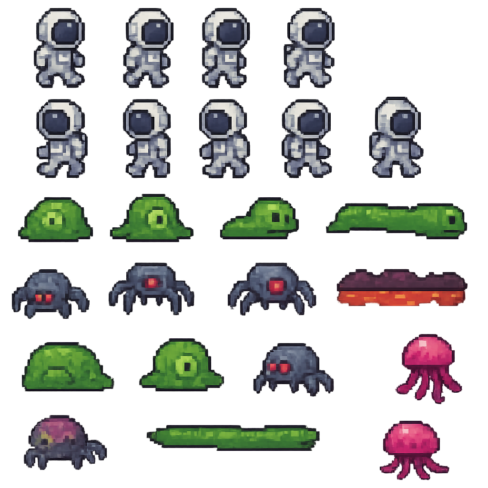
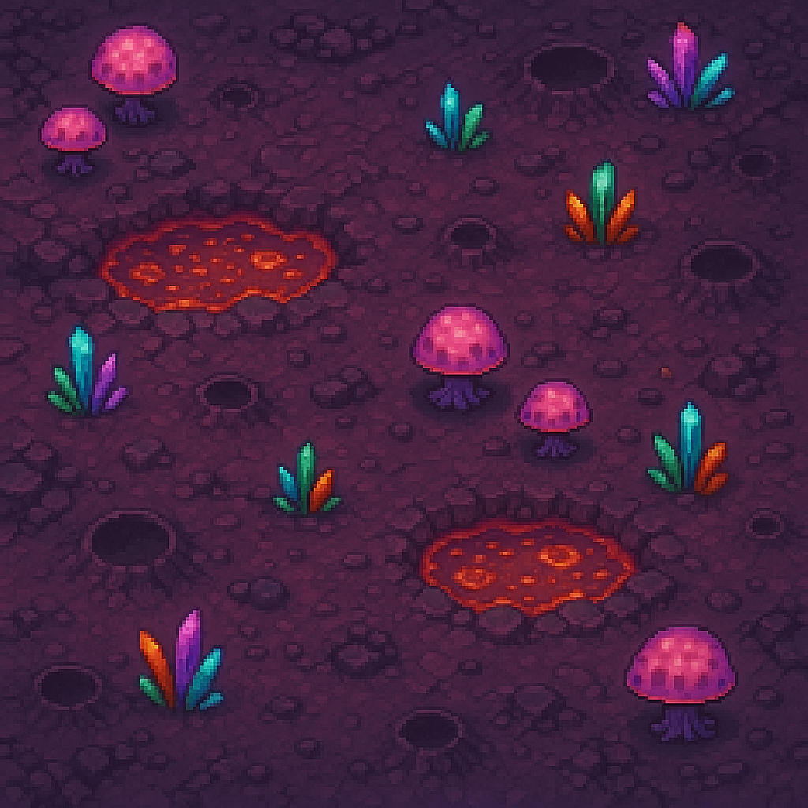
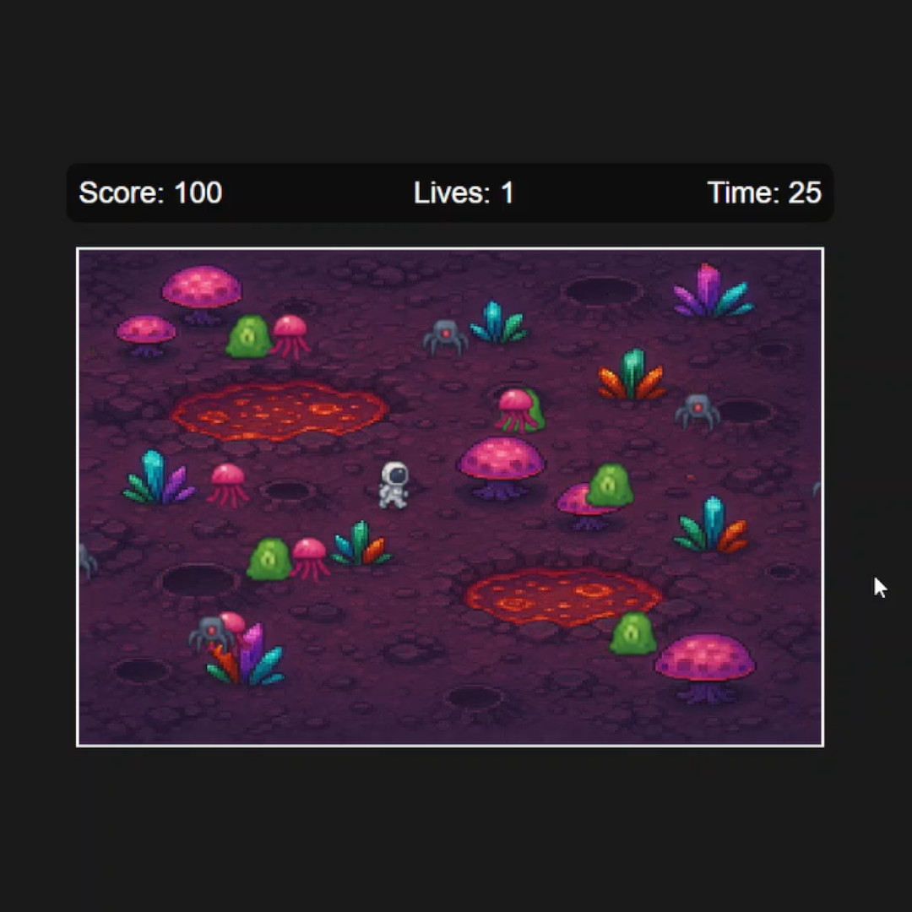

# Amazon Q Build Games Challenge
Simple game created with the help of Amazon Q as part of the AWS Build Games Challenge.

## Can you create a game idea in under an hour using Amazon Q?
Turns out — yes, a simple game, but it's fast, fun, and surprisingly productive.

This project was created as part of the ongoing AWS Build Games Challenge (open until June 30). The challenge:
🕹 “Build a retro-inspired game using Amazon Q Developer CLI.”

## The Idea
I prompted Amazon Q with the following request:

"Please create a game in JavaScript, that can run in a web browser, that uses the well-known Frogger-style crossing mechanic. But instead of a frog and cars we will be using an astronaut and aliens."

Within minutes, Amazon Q generated a functional browser-based game — basic, pixel-style, but fully playable and built with clean JavaScript.

  

## Iterations with Amazon Q
From there, I made several improvements by continuing to prompt Amazon Q:

✅ Implemented spritesheets for the astronaut and aliens

✅ Fixed UI layout for score, timer, and lives

✅ Added multiple alien types for variety

✅ Integrated a background image to enhance the visual atmosphere

All sprite images and background assets were created using ChatGPT (DALL·E image generation).

  

  
  
  
  
  

## The Result
A simple yet fun Frogger-style game with a space theme — built and iterated in under an hour using Amazon Q.

  

<video controls="" width="800" height="500" muted="" loop]="" autoplay="">
  <source src="./videos/AmazonQ_Game_s.mp4" type="video/mp4">
  </video>

## Takeaways

- Amazon Q keeps you in flow — the back-and-forth iteration felt natural and fast.

- It’s not a silver bullet — some programming knowledge is still necessary, especially for debugging or refining logic.

- But it is a powerful co-creator, especially for prototyping and learning.

## What's Included

- index.html – Main game canvas, UI, game logic, sprite handling, and movement
- spritesheets/ – Spritesheet and background images (generated via ChatGPT)
- videos/ - short recording of game
- README.md – This file

## Try the Challenge Yourself
You can enter the challenge here, until June 30:
**[AWS Build Games Challenge](https://community.aws/content/2y6egGcPAGQs8EwtQUM9KAONojz/build-games-challenge-build-classics-with-amazon-q-developer-cli?trk=b3ed9c83-eb20-4f68-b5b4-ffdc878e85c6&sc_channel=em&bb=237784)**

